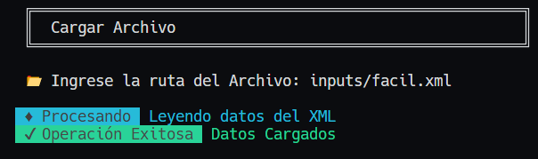
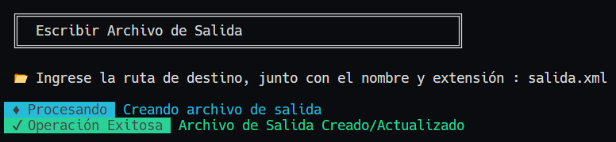
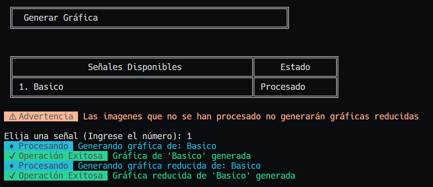

<h1 align="center">Proyecto 1</h1>
<p align="center">
    <a href="#"></a>
</p>
<!-- Descripción del Proyecto -->
<p align="center">Programa en consola para la gestión de señales de audio, y generación de gráfica a travez de graphivz.</p>

<div align="center">
🙍‍♂️ Joab Ajsivinac
</div>
<div align="center">
📕 Introducción a la Programación y Computación 2
</div>
<div align="center"> 🏛 Universidad San Carlos de Guatemala</div>
<div align="center"> 📆 Segundo Semestre 2023</div>

## 📋 Tabla de Contenidos

- [📋 Tabla de Contenidos](#-tabla-de-contenidos)
- [⚒ Requerimientos](#-requerimientos)
- [🗂 Recursos](#-recursos)
- [📟 Instalación](#-instalación)
- [⚡ Inicio Rápido](#-inicio-rápido)
- [💻 Interfaz de Usuario y Funcionalidades](#-interfaz-de-usuario-y-funcionalidades)
  - [Cargar Archivo](#cargar-archivo)
  - [Procesar Archivo](#procesar-archivo)
  - [Escribir Archivo de Salida](#escribir-archivo-de-salida)
  - [Mostrar datos del Estudiante](#mostrar-datos-del-estudiante)
  - [Generar Gráfica](#generar-gráfica)
  - [Inicializar Sistema](#inicializar-sistema)
  - [Salida](#salida)
- [📖 Documentación](#-documentación)


<!-- Requerimientos -->

## ⚒ Requerimientos
<ul>
  <li>Windows 8 o Superior</li>
  <li>macOS Catalina o Superior</li>
  <li>Linux: Ubuntu, Debian, CentOS, Fedora, etc.</li>
  <li>Python 3.10.8 o Superior</li>
  <li>Graphviz 0.20 o superior</li>

</ul>

## 🗂 Recursos
<ul>
  <li><a href="https://www.python.org/downloads/">Python 3.10.8 o Superior</a></li>
  <li><a href="https://pypi.org/project/graphviz/">Graphviz 0.20 o superior</a></li>
</ul>

## 📟 Instalación
Descargue el código o bien clone el repositorio en una carpeta.

Si se opta por la clonación se hace con la siguiente linea de código en terminal (Antes de ejecutar el codigo asegurese de estar en la carpeta donde lo quiere descargar)

```bash
git clone https://github.com/J-Ajsivinac/IPC2_Proyecto1_202200135.git
```

## ⚡ Inicio Rápido
Una vez con la carpeta del proyecto y teniendo los recursos, dirijase a donde está al archivo `main.py` y ejecutelo de la siguiente forma

```bash
python main.py
```

Luego se ejecutará la aplicación por consola

## 💻 Interfaz de Usuario y Funcionalidades
Al ejecutar la aplicación se desplegará la siguiente ventana, la cual es la principal:
<p align="center">
    
</p>

El menú cuenta con 7 opciones, las cuales tienen una funcionalidad especifica.

### Cargar Archivo
> Opción 1

El programa pedirá la ruta del archivo de entrada (existen archivos de entrada muestra en la carpeta `Inputs`)

<p align="center">
    
</p>

Se mostrará en consola las acciones que esta haciendo el programa, cuando el programa termine de leer el archivo se mostrar un mensaje, diciendo que los datos se han cargado

### Procesar Archivo
> Opción 2

El programa procesara las señales leidas en la carga de archivos, mostrando el avance del procesamiento en forma de alertas, al finalizar el procesado, se le desplegara una alerta indicando que se termino el procesamiento
<p align="center">
    
</p>

### Escribir Archivo de Salida
> Opción 3

El programa pedirá la ruta donde se guardara el archivo junto con el nombre con el que se va a guardar el archivo (incluir la extensión .xml). El archiv contendra los datos de las señales procesadas, cuando el archivo se crea, se muestra un mensaje para indicarlo

<p align="center">
    
</p>

### Mostrar datos del Estudiante
> Opción 4

En este apartado se mostrará la información del estudiante que realizo el programa

### Generar Gráfica
> Opción 5

En ese apartado se mostrará un listado de las señales leidas, junto con el estado de cada señal (leer la aclaración mostrada en consola)

<p align="center">
    
</p>

Elija la señal que quiera graficar, escribiendo el numero de la señal requerida, se creará una carpeta llamada `img` en la cual se mostrará las gráficas en formato svg, el nombre del archivo es el mismo nombre de la señal.

### Inicializar Sistema
> Opción 6

Reinicia todo el sistema, borrando las señales cargadas anteriormente, para poder iniciar con una carga nueva de señales

### Salida
> Opción 7

Cierra el programa

## 📖 Documentación
Para comprender de mejor manera el funcionamiento del sistema puede, 
<a href="https://github.com/J-Ajsivinac/IPC2_Proyecto1_202200135/blob/main/Doc/Documentaci%C3%B3n.pdf">Ver documentación</a>